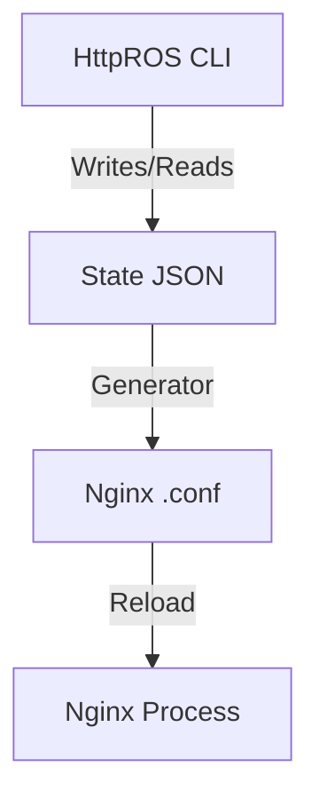

# HttpROS - Http Router Operating System

[](https://opensource.org/licenses/MIT)

**HttpROS** is a high-level Nginx wrapper designed to provide a network equipment-like CLI experience (inspired by Datacom, Huawei, and Cisco) for managing HTTP routes, SSL certificates, and security.

It transforms the complex Nginx configuration process into a structured, interactive, and human-readable workflow using a hierarchical command system.

## 🚀 Features

- **Network-style CLI**: Hierarchical modes (View, Config, Route-Config) with context-sensitive help (`?`) and Tab completion.
- **Unified Routing**: Manage Reverse Proxies, Static Sites, and Redirects from a single interface.
- **Advanced SSL**: Automatic Let's Encrypt integration or manual certificate management.
- **Granular Security**: IP Filtering (Whitelist/Blacklist) with default policy switching.
- **Traffic Control**: Rate limiting and Load balancing (Upstreams).
- **Rich Interaction**: Huawei-style detailed views (`show proxy <domain>`) and Cisco-style running config blocks (`show`).
- **State Persistence**: All configurations are stored in clean JSON files, making it easy to version and backup.

## 🛠 Installation

```bash
# Clone the repository
git clone https://github.com/kaua-alves-queiros/HttpROS.git

# Build and run
cd HttpROS
dotnet run
```

## 📖 Quick Start

1. Enter configuration mode:
   ```text
   HttpROS> configure
   HttpROS(config)#
   ```
2. Create a new proxy route:
   ```text
   HttpROS(config)# proxy myapi.com
   HttpROS(config-route-myapi.com)# target 10.0.0.50:8080
   HttpROS(config-route-myapi.com)# ssl lets-encrypt
   HttpROS(config-route-myapi.com)# ip-filter mode whitelist
   HttpROS(config-route-myapi.com)# whitelist 192.168.1.100
   HttpROS(config-route-myapi.com)# save
   ```
3. Verify your configuration:
   ```text
   HttpROS(config)# show routes
   HttpROS(config)# show proxy myapi.com
   ```

## 🏗 Architecture

HttpROS acts as a control plane. It manages a JSON-based state and generates the corresponding Nginx `.conf` files, then triggers an Nginx reload.



## 📄 License

This project is licensed under the MIT License - see the [LICENSE](LICENSE) file for details.
