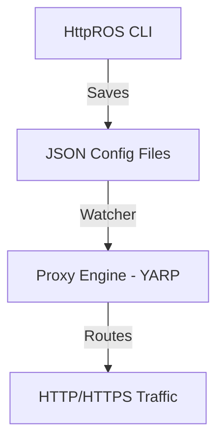

# HttpROS - Http Router Operating System

[](https://opensource.org/licenses/MIT)

**HttpROS** is a reverse proxy and redirect engine with a network-style CLI (inspired by Datacom/Cisco). It manages HTTP routes, SSL certificates, and security through a command-line interface.

## 🚀 Features

- **Network-style CLI**: Hierarchical modes (View, Config, Route-Config) with context-sensitive help (`?`) and Tab completion.
- **Unified Routing**: Reverse Proxies, Static Sites, and Redirects from a single interface.
- **Advanced SSL**: SNI support with Let's Encrypt or manual certificates.
- **Security**: IP Filtering (Whitelist/Blacklist) and Basic Auth.
- **Traffic Control**: Rate limiting and Load balancing (Upstreams).
- **Engine Control**: `engine start/stop/status` directly from the CLI.
- **Persistence**: All configurations are stored in JSON files.

## 🛠 Installation

```bash
# Clone the repository
git clone https://github.com/kaua-alves-queiros/HttpROS.git

# Build and run
cd HttpROS
dotnet run
```

## 📖 Quick Start

1. Enter configuration mode:
   ```text
   HttpROS> configure
   HttpROS(config)#
   ```
2. Create a new proxy route:
   ```text
   HttpROS(config)# proxy myapi.com
   HttpROS(config-route-myapi.com)# target 10.0.0.50:8080
   HttpROS(config-route-myapi.com)# ssl lets-encrypt
   HttpROS(config-route-myapi.com)# ip-filter mode whitelist
   HttpROS(config-route-myapi.com)# whitelist 192.168.1.100
   HttpROS(config-route-myapi.com)# save
   ```
3. Verify your configuration:
   ```text
   HttpROS(config)# show routes
   HttpROS(config)# show proxy myapi.com
   ```

## 🏗 Architecture

HttpROS uses a decoupled architecture where the CLI manages the state and the Proxy Engine (YARP) handles the traffic.



## 📄 License

This project is licensed under the MIT License - see the [LICENSE](LICENSE) file for details.
