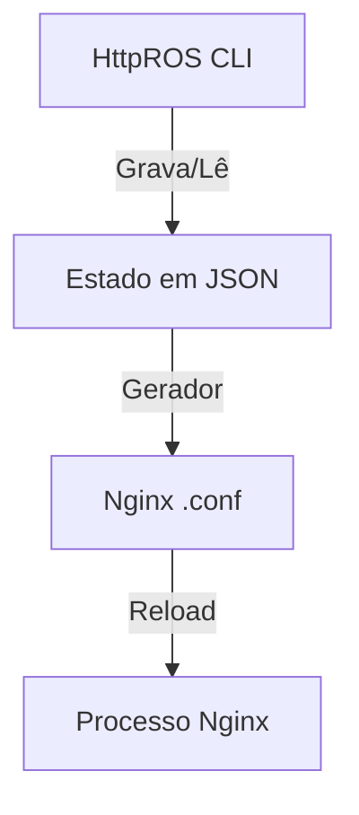

# HttpROS - Http Router Operating System

HttpROS é um wrapper de alto nível para o Nginx, projetado para oferecer uma experiência de configuração via CLI inspirada em sistemas operacionais de rede (Datacom, Huawei, Cisco). O objetivo é gerenciar rotas HTTP, certificados SSL, e segurança de forma declarativa e interativa.

## Funcionalidades Planejadas / Implementadas

- [x] **Proxy Reverso**: Encaminhamento de tráfego para backends.
- [x] **Static Serving**: Entrega de arquivos estáticos.
- [x] **Redirect**: Redirecionamentos HTTP simples e permanentes.
- [x] **SSL Automatizado**: Integração com Let's Encrypt e suporte a certificados manuais.
- [x] **Gzip/Compression**: Ativação de compressão de dados.
- [x] **Basic Auth**: Proteção de rotas com usuário e senha.
- [x] **IP Filtering**: Whitelist e Blacklist com modos de operação.
- [x] **Websockets**: Suporte a upgrade de protocolos.
- [x] **CORS**: Gerenciamento de headers Cross-Origin.
- [x] **Rate Limiting**: Controle de requisições por segundo.
- [x] **Load Balancing**: Upstreams configuráveis.
- [x] **Custom Error Pages**: Páginas de erro 404, 500, etc.
- [x] **Backup & Restore**: Persistência e recuperação de estado.
- [/] **Nginx Generator**: Geração automática de arquivos `.conf`.
- [ ] **API Interna**: Endpoint para automação.

## Arquitetura de Estado

O sistema utiliza arquivos JSON como fonte de verdade para o estado das rotas.
- Diretórios: `./proxy/`, `./static/`, `./redirect/`
- Arquivos: `<dominio>.json`



---

## Manual de Comandos (CLI Reference)

O HttpROS opera em três níveis de hierarquia.

### 1. Modo de Visualização (`HttpROS>`)
| Comando | Argumentos | Descrição |
| :--- | :--- | :--- |
| `show routes` | - | Lista todas as rotas configuradas (resumo). |
| `show <type> <domain>` | `proxy`, `static`, `redirect` | Detalhes completos (Estilo Huawei). |
| `show status` | - | Saúde do sistema e Nginx. |
| `show logs` | - | Últimas linhas dos logs. |
| `show version` | - | Versão atual. |
| `configure` | - | Entra no Modo Global. |
| `clear` | - | Limpa terminal. |
| `exit` | - | Encerra app. |

---

### 2. Modo de Configuração Global (`HttpROS(config)#`)
| Comando | Argumentos | Descrição |
| :--- | :--- | :--- |
| `proxy` | `<domain>` | Configura um Proxy. |
| `no proxy` | `<domain>` | Deleta a rota. |
| `static` | `<domain>` | Configura Static site. |
| `no static` | `<domain>` | Deleta a rota. |
| `redirect` | `<domain>` | Configura Redirect. |
| `no redirect` | `<domain>` | Deleta a rota. |
| `backup` | - | Gera snapshot. |
| `restore` | - | Restaura snapshot. |
| `exit` | - | Volta ao modo view. |

---

### 3. Modo de Configuração de Rota (`HttpROS(config-route-xxx)#`)
Digitar `show` exibe o "running-config" do bloco.

| Comando | Argumentos | Descrição |
| :--- | :--- | :--- |
| `target` | `<val>` | Define o destino. |
| `no target` | - | Limpa destino. |
| `upstream` | `<ip>` | Adiciona IP ao balanceamento. |
| `no upstream` | `<ip>` | Remove IP. |
| `ssl` | `lets-encrypt / manual <name>` | Configura SSL. |
| `no ssl` | - | Desativa HTTPS. |
| `gzip` | `enable / disable` | Toggle compressão. |
| `websockets` | `enable / disable` | Toggle websockets. |
| `cors` | `enable / disable` | Toggle CORS. |
| `auth` | `<user> <pass>` | Define Basic Auth. |
| `no auth` | - | Remove Auth. |
| `ip-filter mode`| `whitelist / blacklist` | Define política padrão. |
| `whitelist` | `<ip>` | Permite IP. |
| `no whitelist` | `<ip>` | Remove IP. |
| `blacklist` | `<ip>` | Bloqueia IP. |
| `no blacklist` | `<ip>` | Desbloqueia IP. |
| `rate-limit` | `<v>` | Ex: `10r/s`. |
| `error-page` | `<cod> <path>` | Página de erro. |
| `save` | - | Salva e sai. |
| `exit` | - | Sai sem salvar. |

---

## Estrutura JSON (Exemplo de Estado)

```json
{
  "domain": "api.exemplo.com",
  "type": "proxy",
  "target": "http://10.0.0.50:8080",
  "upstreams": [],
  "features": {
    "ssl": {
      "enabled": true,
      "provider": "lets-encrypt",
      "certName": null
    },
    "gzip": true,
    "websockets": true,
    "cors": false,
    "ipFilter": {
      "mode": "blacklist",
      "whitelist": [],
      "blacklist": ["192.168.1.50"]
    },
    "basicAuth": { "user": "admin", "pass": "123" },
    "rateLimit": "10r/s",
    "customErrorPages": { "404": "/custom_404.html" }
  }
}
```
